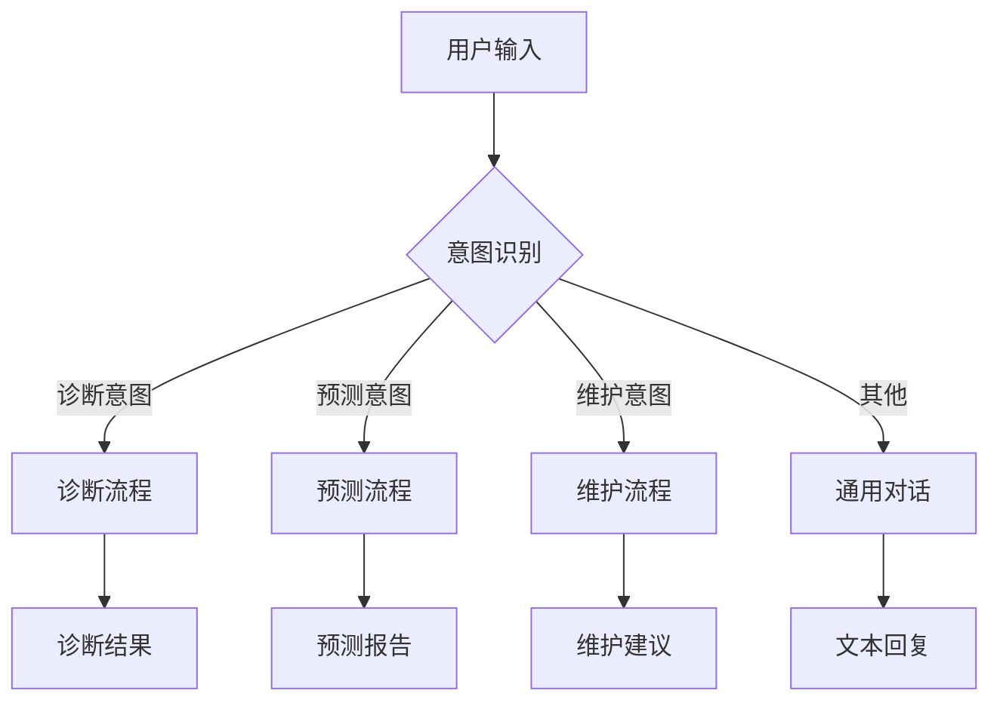
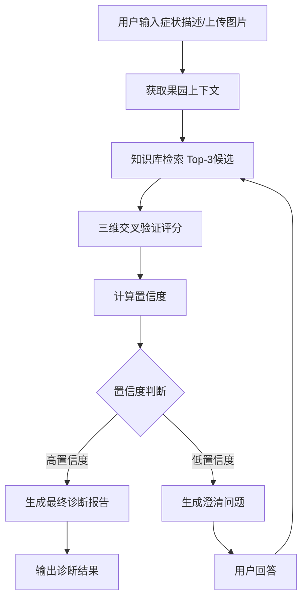
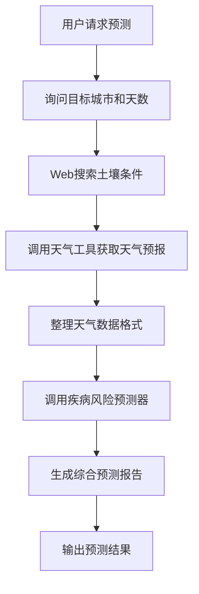
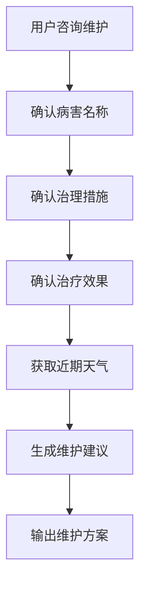
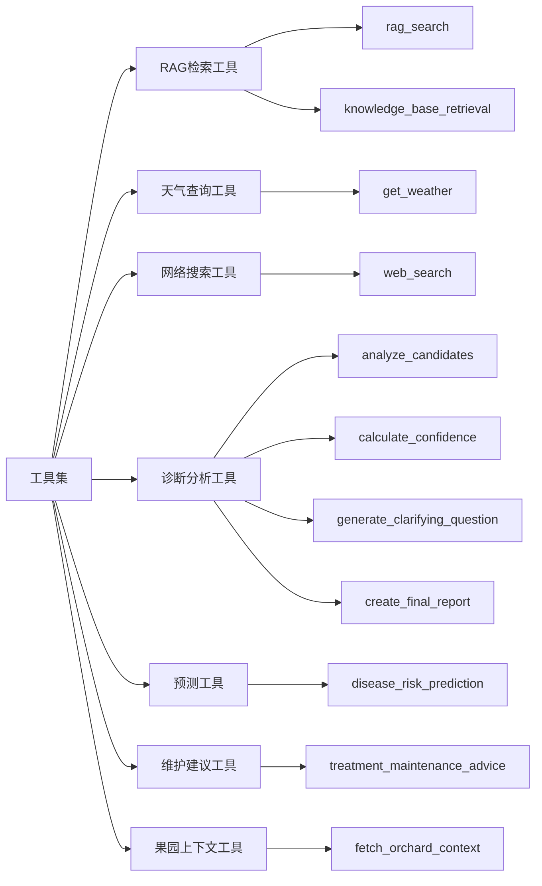
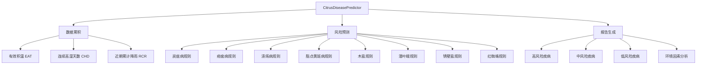
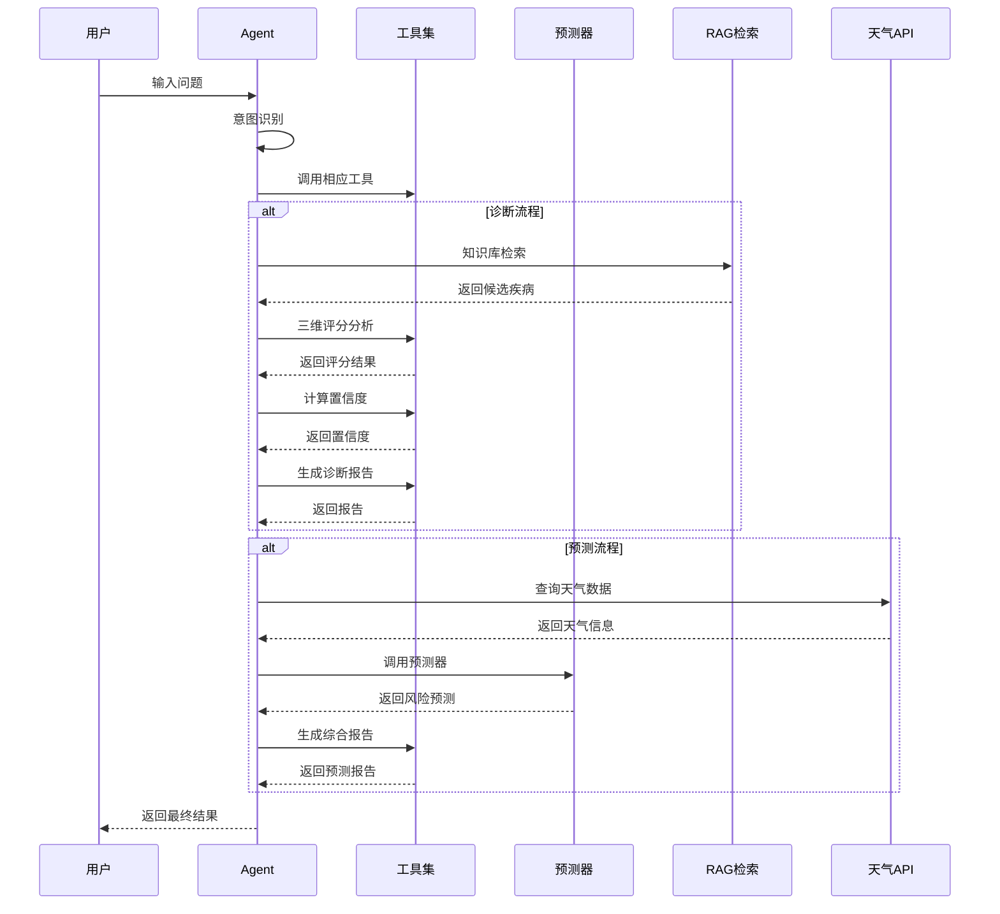

# 柑橘病虫害智能Agent工作机制流程图

## 系统架构概览

## 详细工作流程

### 1. 诊断流程 (Diagnosis Workflow)

### 2. 预测流程 (Prediction Workflow)

### 3. 维护流程 (Maintenance Workflow)

## 核心组件详解

### 工具集 (Tools)

### 预测器模块 (Predictor Module)

## 数据流转图

## 关键技术特点

1. **多模态支持**: 支持文本和图像输入
2. **实时回调**: 通过WebSocket推送处理进度
3. **记忆管理**: 使用ConversationBufferMemory保持对话上下文
4. **并行处理**: 使用ThreadPoolExecutor并行处理候选疾病评分
5. **规则引擎**: 基于专家规则的疾病风险预测
6. **RAG检索**: 使用BM25稀疏检索器进行知识库查询
7. **置信度评估**: 三维交叉验证评分机制
8. **JSON格式输出**: 结构化输出便于前端解析

## 输出格式

- **诊断报告**: `{"type": "diagnosis_report", "content": "...", "primary_diagnosis": "...", "confidence": 0.85, ...}`
- **澄清问题**: `{"type": "clarification", "content": "...", "options": [...]}`
- **普通文本**: `{"type": "text", "content": "..."}`
